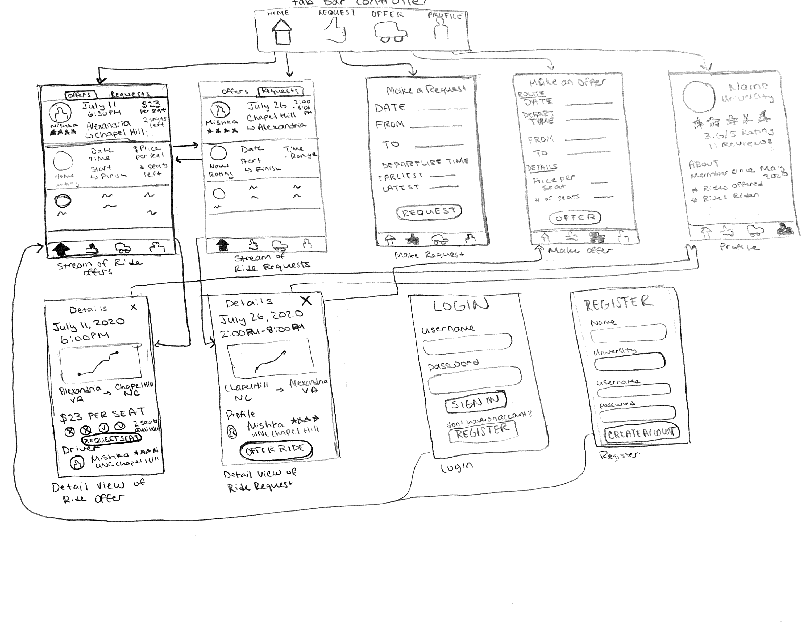

Original App Design Project - README Template
===

# College Carpool (need to change the name)

## Table of Contents
1. [Overview](#Overview)
1. [Product Spec](#Product-Spec)
1. [Wireframes](#Wireframes)
2. [Schema](#Schema)

## Overview
### Description
College Carpool is an application for university students only to carpool with other students to and from their university. Students who are offering rides will input the ride information (price per passenger, number of seats available, starting and ending locations, departure time and date) into the app. Students who are searching for a ride will input their desired starting and ending location and departure date/time. The app will then load a list of available rides that are within a specified radius of the inputted start and ending location. Users can message other students to find out more information about the ride. 

### App Evaluation
- **Category:** Transportation
- **Mobile:** The app uses location and maps to track the user and allow them to input the starting location and destination. Users are able to message other users and enable push notifications from the messages on the app. App also sends push notifications when users upload ride information that matches their requested ride. 
- **Story:** App allows students to find rides being offered by other university students for a cheaper price than other ride sharing apps such as Uber and Lyft. Students who are offering rides can post on the app and request a fee per seat in the carpool. Both parties benefit from the app. 
- **Market:** Any university student who is travelling long distance would find this app useful. Many students struggle to find a way to get home from college (and vice versa) and there are plenty of students with cars who drive home from campus (and vice versa) who have seats for extra passengers and want to make some extra money. In addition to find rides to and from home, the app would also be useful in finding rides to big events occuring nearby or to other college campuses that would be too expensive to Uber/Lyft. 
- **Habit:** Users would use the app if they are requesting a ride or offering a ride. In the process of finding a ride or finding ride passengers they would use the app very frequently to communicate with other students on the app. 
- **Scope:** The app would include a sign in for users and a way for them to post rides. 

## Product Spec

### 1. User Stories (Required and Optional)

**Required Must-have Stories**

* User can create a new account
* User can login
* User can post a ride and upload the following information:
    * Starting location
    * Ending location
    * Ride date & time
    * Price per seat
    * Number of available seats
* User can request a ride with the following information:
    * Starting location
    * Ending location
    * Ride date & time range
* User can scroll through list of ride offers & requests
* User can click on a ride request or offer to view more details
* User can book a seat in a ride
* User can create a ride offer based on a user's ride request
* User can view their own profile and other profiles to see more details

**Optional Nice-to-have Stories**

* User can filter the stream of ride offers/requests by inputing information such as date, time, location (to/from), and price
* Users can upload a profile picture
* Users can rate other users in their carpool after the ride
* User can message other users to confirm details about a ride
* After requesting a ride, users can view rides matching their request and select a ride. If there are no rides matching their request or the user doesn't want to use the rides available, the request will go through
* After offering a ride, users can view requests matching their request and offer their ride to the user.
* Users can get push notifications when other users upload a ride offer that matches or is similar to their request
* Users can get push notificatins when other uers upload a ride request that matches or is similar to their offer 
* Users can pay through the app

### 2. Screen Archetypes

* Login Screen
   * User can login to their account
* Registration Screen
   * User can create a new account
* Ride Request Screen
    * User can input information and request a ride
* Ride Offer Screen
    * User can input information and offer a ride
* User Profile Screen
    * User can view profile information of themself or another user
* Ride Stream Screen
    * Ride Offers Stream Screen
        * Users can scroll through list of ride offers
    * Ride Requests Stream Screen
        * Users can scroll through list of ride requests
* Ride Detail Screen
    * Ride Offer Detail Screen
        * Users can view additional information about a ride offer
    * Ride Request Detail Screen
        * User can view additional information about a ride request

### 3. Navigation

**Tab Navigation** (Tab to Screen)

* Ride Stream Screen
* Ride Request Screen
* Ride Offer Screen
* User Profile Screen

**Flow Navigation** (Screen to Screen)

* Login Screen
--> Ride Offer Stream Screen
--> Registration
* Registration
--> Ride Offer Stream Screen
* Ride Request Stream Screen
--> Ride Request Detail Screen 
--> Ride Offers Stream Screen
* Ride Offer Stream Screen
--> Ride Offers Detail Screen 
--> Ride Request Stream Screen
* Ride Offer Detail Screen
--> User Profile Screen
* Ride Request Detail Screen
--> User Profile Screen
--> Ride Offer Screen
* Ride Request Screen
--> 
* Ride Offer Screen
--> 
* User Profile Screen
--> None

## Wireframes

## Schema

[This section will be completed in Unit 9]
### Models
[Add table of models]
### Networking
- [Add list of network requests by screen ]
- [Create basic snippets for each Parse network request]
- [OPTIONAL: List endpoints if using existing API such as Yelp]
